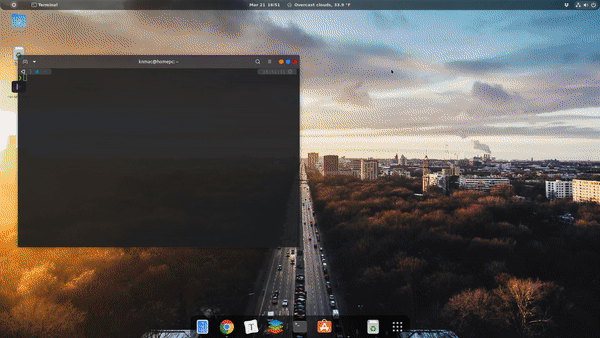

# Linux settings
Some linux settings I have been collecting.
<!---->

{width=100%}


## 0. Fonts configuration (Optional)
This is to display glyphs and breadcrumbs for Neovim and Tmux correctly. Visit [here](https://www.nerdfonts.com/#home) for more information. My favorite ones are [SauceCode Pro](https://github.com/ryanoasis/nerd-fonts/releases/download/v2.1.0/SourceCodePro.zip) and [FiraCode](https://github.com/tonsky/FiraCode/releases/download/2/FiraCode_2.zip) (also included in `fonts` directory).

You then may have to configure the font for your preferred terminal manually.


## 1. Auto installation (required sudo)
This is to install everything automatically. However, I recommend to open the installation files and execute only necessary sections. Some installation guides are also given here.

Installation:
```bash
git clone https://github.com/knmac/linux_settings.git
cd linux_settings
sudo sh ./install_auto.sh
```


## 2. Neovim

### 2.1. Installation
Install neovim dependencies:
```bash
sudo apt-get install python-dev python-pip python3-dev python3-pip curl exuberant-ctags
pip3 install --user pynvim flake8 pylint
```

Install neovim with my configuration:
```bash
sudo add-apt-repository ppa:neovim-ppa/stable
sudo apt-get update
sudo apt-get install neovim
mkdir -p $HOME/..config/nvim
cp nvim/* $HOME/.config/nvim
```

If you see this error (usually seen when run neovim in a virtual environment): 
`[deoplete] deoplete failed to load. Try the :UpdateRemotePlugins command and restart Neovim. See also :checkhealth.`. 
Follow these steps:

1. Install/upgrade some packages:
```bash
pip install --user --upgrade pynvim
pip3 install --user --upgrade pynvim
```
2. Then open Neovim and run:
```
:UpdateRemotePlugins
```

### 2.2. Cheatsheet
[Neovim cheatsheet](nvim_cheatsheet.md)


## 3. Tmux
### 3.1. Building from source
Change the versions, URLs, and paths accordingly in `install_tmux.sh`.

Then add these two lines in your `.bashrc` or `.zshrc`:
```bash
export PATH="$HOME/.local/bin":$PATH
export LD_LIBRARY_PATH="$HOME/.local/lib":$LD_LIBRARY_PATH
```

### 3.2. Cheatsheet
[Tmux cheatsheet](tmux_cheatsheet.md)


## 4. Some tools to help you ditch GUI ;)

(You may look in `others` directory for more information about my configuration.)

- Web browser and pager: `w3m`
- Email client: `neomutt`
- File manager: `ranger-fm` (I also use `ueberzug` for image preview method)
- List contents in tree-like format: `tree`
- File searcher: `rg` (ripgrep - improved version of `grep`)
- File preview with syntax highlighting: `bat`
- Interactive process viewer: `htop`
- Document converter: `pandoc`
- Video converter: `ffmpeg`
- Music player client: `ncmpcpp`, `mpd`, `mpc` [moreinfo](https://computingforgeeks.com/how-to-configure-mpd-and-ncmpcpp-on-linux/)
<!--- Youtube/Spotify/... streamer: `tizonia`-->
- Bandwidth monitor and rate esimator: `bmon`
- System info viewer: `neofetch`
- PDF reader (this is with GUI): `zathura`
